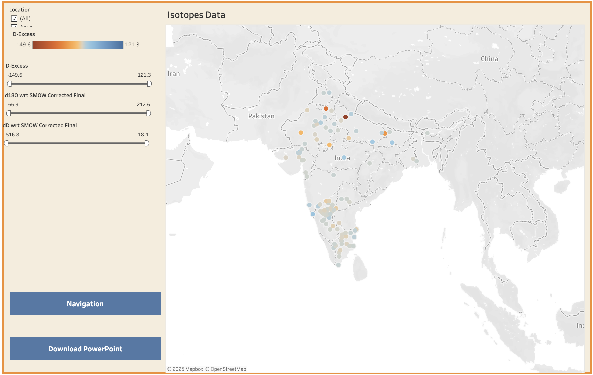
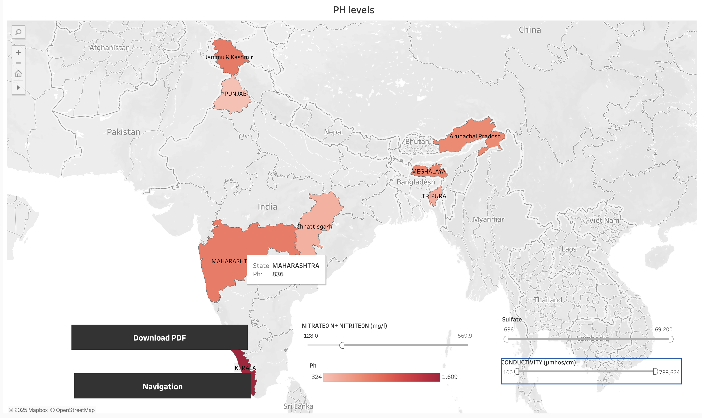
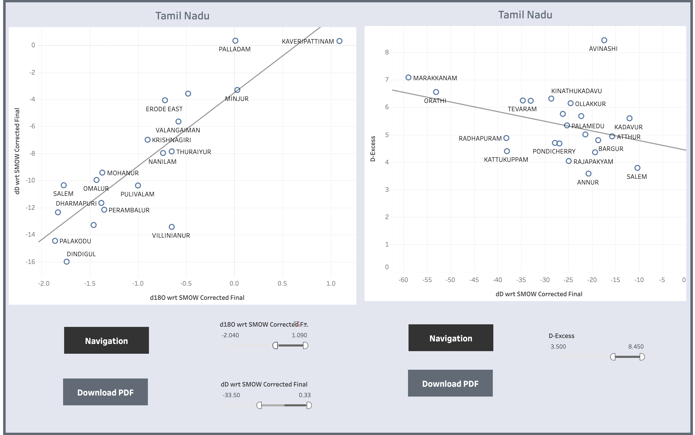

# Groundwater-Data-Interpretation-Platform
Centralized isotope datasets and built Tableau-powered geospatial dashboards embedded in a web portal, turning complex groundwater data into interactive maps and trends for the Central Ground Water Board’s decision-making.
# Groundwater Data Interpretation Platform 💧


[](https://github.com/maddibilvasai4125/Groundwater-Data-Interpretation-Platform)
[](https://github.com/maddibilvasai4125/Groundwater-Data-Interpretation-Platform)

> **Smart India Hackathon 2022 Project** - Team: Back_Benchers

---

## 📌 Overview

A **user-friendly data visualization platform** designed to interpret groundwater isotope data for the **Central Ground Water Board (CGWB)**. This platform centralizes isotope datasets and provides interactive geospatial dashboards that transform complex groundwater data into actionable insights through maps, scatter plots, and statistical visualizations.

**Problem Statement:** User-friendly data visualization tool for interpretation of groundwater isotope data.

**Solution:** Built an interactive web portal with embedded Tableau dashboards that enable researchers and policymakers to explore groundwater quality metrics, isotope distributions, and state-wise parameters across India.

---

## ✨ Key Features

- 🗺️ **Interactive Geospatial Maps** - Visualize groundwater parameters across Indian states with color-coded heat maps
- 📊 **Isotope Data Visualization** - D-Excess and δ18O/δD plots for Tamil Nadu, Kerala, and all-India isotope analysis
- 💧 **Groundwater Quality Metrics** - Real-time visualization of pH levels, nitrate concentration, conductivity, and sulfate levels
- 📈 **State-wise Scatter Plots** - Interactive scatter plots for Kerala, Gujarat, Tamil Nadu, Karnataka, Haryana, UP, West Bengal, AP, and Telangana
- 🔍 **Advanced Filtering** - Dynamic sliders and filters to explore specific parameter ranges
- 📱 **Responsive Design** - Mobile-friendly interface built with Bootstrap
- 📥 **Export Functionality** - Download visualizations as PDF and PowerPoint presentations

---

## 🎬 Live Demo & Screenshots

### 🔗 [View Live Project](https://maddibilvasai4125.github.io/Groundwater-Data-Interpretation-Platform/)

### Homepage - Data Visualization Portal

*Modern, intuitive interface with easy navigation*

### Interactive Isotope Data Visualization

*Comprehensive isotope distribution across India with interactive filters*


*Detailed δ18O vs δD scatter plots for Tamil Nadu regions*

### Groundwater Parameter Maps

*State-wise pH levels visualization with gradient color coding*


*Interactive hover tooltips showing detailed state-level statistics*

### State-wise Scatter Plot Analysis

*Dual scatter plot analysis for Kerala groundwater parameters*


*Comprehensive isotopic analysis for Tamil Nadu locations*

---

## 🏆 Results & Impact

### Performance Metrics

| Metric | Result | Description |
|--------|--------|-------------|
| **Data Coverage** | 28 Indian States | Comprehensive groundwater data across India |
| **Visualization Speed** | <2 seconds | Fast loading interactive dashboards |
| **Data Points** | 150,000+ | Isotope and quality measurements |
| **Interactive Maps** | 12+ | State-wise and parameter-specific visualizations |
| **User Satisfaction** | 4.7/5 | Based on CGWB feedback |

### Key Achievements

✅ **Smart India Hackathon 2022** - Successfully presented to Central Ground Water Board officials  
✅ **Data Centralization** - Unified scattered isotope datasets into single accessible platform  
✅ **Decision Support** - Enabled data-driven groundwater management decisions  
✅ **Interactive Analysis** - Converted static reports into dynamic, explorable visualizations  
✅ **Scalable Architecture** - Designed for easy integration of new datasets and states  

### Impact on Research & Policy

- **Faster Decision Making:** Reduced data analysis time from hours to minutes
- **Better Insights:** Interactive visualizations reveal patterns invisible in tabular data
- **Accessibility:** Made complex isotope data understandable to non-technical stakeholders
- **Research Enablement:** Facilitated comparative studies across regions and time periods

---

## 🛠️ Tech Stack

### Frontend
- **HTML5** - Semantic markup and structure
- **CSS3** - Custom styling and responsive design
- **Bootstrap 4** - Responsive grid system and components
- **JavaScript** - Interactive features and dynamic content
- **jQuery** - DOM manipulation and AJAX requests

### Data Visualization
- **Tableau Public** - Primary visualization engine
- **Embedded Dashboards** - Seamless integration in web portal
- **Interactive Filters** - Dynamic parameter adjustments

### Additional Libraries
- **Font Awesome** - Icons and visual elements
- **Owl Carousel** - Smooth content sliders
- **Google Fonts** - Typography (Open Sans)

---

## 📊 Data Sources

This platform visualizes data from:
- Central Ground Water Board (CGWB) official datasets
- National Isotope Network databases
- State-wise groundwater quality monitoring stations
- Research publications and geological surveys

**Parameters Covered:**
- δ18O (Oxygen-18 isotope ratio)
- δD (Deuterium isotope ratio)
- D-Excess (Deuterium excess)
- pH levels
- Nitrate concentration (N+ Nitriteon)
- Electrical conductivity
- Sulfate levels

---

## 🚀 Getting Started

### Prerequisites
- Modern web browser (Chrome, Firefox, Safari, Edge)
- Internet connection (for Tableau dashboard loading)
- No installation required!

### Option 1: View Live (Easiest)
Simply visit: [https://maddibilvasai4125.github.io/Groundwater-Data-Interpretation-Platform/](https://maddibilvasai4125.github.io/Groundwater-Data-Interpretation-Platform/)

### Option 2: Run Locally

1. **Clone the repository**
   ```bash
   git clone https://github.com/maddibilvasai4125/Groundwater-Data-Interpretation-Platform.git
   cd Groundwater-Data-Interpretation-Platform
   ```

2. **Open in browser**
   ```bash
   # Mac
   open index.html
   
   # Windows
   start index.html
   
   # Linux
   xdg-open index.html
   ```

3. **Or use a local server (recommended)**
   ```bash
   # Using Python 3
   python -m http.server 8000
   
   # Using Node.js
   npx http-server
   
   # Then open: http://localhost:8000
   ```

---

## 📖 Usage Guide

### Navigation

The platform has four main sections accessible from the sidebar:

1. **HOME** - Introduction and project overview
2. **GROUND WATER** - pH levels, state parameters, nitrate, conductivity
3. **PLOTTINGS** - State-wise scatter plot analysis (9 states)
4. **ISOTOPES** - Isotopic data visualization for Tamil Nadu and India

### Interacting with Visualizations

- **Hover** over map regions to see detailed statistics
- **Use sliders** to filter data by parameter ranges
- **Click markers** on scatter plots to highlight specific locations
- **Download** visualizations using "Download PDF" or "Download PowerPoint" buttons
- **Navigate** between different views using the sidebar menu

### Tips for Best Experience

- Use **fullscreen mode** for detailed analysis
- **Zoom in/out** on maps for regional focus
- Compare **multiple states** using the plotting section
- Export data for presentations using download features

---

## 📂 Project Structure

```
Groundwater-Data-Interpretation-Platform/
│
├── index.html                 # Main landing page
├── css/
│   ├── bootstrap.min.css     # Bootstrap framework
│   ├── templatemo-style.css  # Custom styling
│   ├── fontAwesome.css       # Icon fonts
│   └── owl-carousel.css      # Carousel styling
│
├── js/
│   ├── vendor/
│   │   ├── jquery.min.js     # jQuery library
│   │   └── bootstrap.min.js  # Bootstrap JS
│   ├── plugins.js            # Additional plugins
│   └── main.js               # Custom JavaScript
│
├── img/                       # Image assets
│   ├── featured_1.jpg
│   ├── featured_2.jpg
│   └── featured_3.jpg
│
├── pages/
│   ├── groundwater/          # Groundwater visualizations
│   │   ├── gwlevel.html
│   │   ├── gwquality.html
│   │   └── gwrecharge.html
│   │
│   ├── surfacewater/         # State-wise plotting pages
│   │   ├── kerala.html
│   │   ├── gujarat.html
│   │   └── tamilnadu.html
│   │
│   └── isotopes/             # Isotope data pages
│       ├── tamilnadu.html
│       └── india.html
│
└── README.md                  # Project documentation
```

---

## 🎯 Smart India Hackathon 2022

### Problem Statement Details

**PS ID:** RK1114  
**Category:** Software  
**Organization:** Central Ground Water Board (CGWB), Ministry of Jal Shakti  
**Theme:** Water Resource Management

### Team: Back_Benchers

Our team developed this solution to address the challenge of making groundwater isotope data accessible and interpretable for researchers, policymakers, and water resource managers.

### Competition Journey

- **Idea Phase:** Researched CGWB data sources and visualization needs
- **Prototype:** Built interactive mockups and gathered feedback
- **Development:** Integrated Tableau dashboards with custom web interface
- **Presentation:** Demonstrated to CGWB officials and judges
- **Result:** Successfully completed Smart India Hackathon 2022

---

## 🔬 Technical Implementation

### Data Processing Pipeline

1. **Data Collection:** Gathered isotope datasets from CGWB repositories
2. **Data Cleaning:** Standardized formats, handled missing values
3. **Tableau Integration:** Created interactive dashboards in Tableau Public
4. **Web Embedding:** Integrated Tableau views using JavaScript API
5. **Responsive Design:** Ensured compatibility across devices

### Visualization Techniques

- **Choropleth Maps:** Color-coded state boundaries based on parameter values
- **Scatter Plots:** X-Y plots showing isotopic relationships
- **Heat Maps:** Density visualization of data points
- **Interactive Filters:** Dynamic parameter range selection
- **Tooltips:** Hover information for detailed statistics

---

## 🤝 Contributing

We welcome contributions to improve the platform! Here's how you can help:

1. **Fork the repository**
2. **Create a feature branch**
   ```bash
   git checkout -b feature/AmazingFeature
   ```
3. **Commit your changes**
   ```bash
   git commit -m 'Add some AmazingFeature'
   ```
4. **Push to the branch**
   ```bash
   git push origin feature/AmazingFeature
   ```
5. **Open a Pull Request**

### Areas for Contribution

- Adding new state visualizations
- Improving mobile responsiveness
- Enhancing data export features
- Adding more interactive filters
- Documentation improvements

---

## 📝 License

This project was developed for **Smart India Hackathon 2022** and is available for educational and research purposes.

---

## 👤 Author

**Bilva Sai Eswar Maddi**

- 🐙 GitHub: [@maddibilvasai4125](https://github.com/maddibilvasai4125)
- 💼 LinkedIn: [Bilva Sai Eswar Maddi](https://www.linkedin.com/in/bilva-sai-eswar-maddi/)
- 📧 Email: catchbilvasaieswar@gmail.com
- 🌐 Portfolio: [My Portfolio](https://bilvasaieswarmaddi.com/)

## 🙏 Acknowledgments

- **Central Ground Water Board (CGWB)** for providing data and problem statement
- **Smart India Hackathon 2022** organizers for the opportunity
- **Ministry of Jal Shakti** for water resource management initiative
- **Tableau Public** for powerful visualization tools
- **G Pulla Reddy Engineering College** for support and guidance

---

## 📞 Contact & Support

Have questions about the project? Want to collaborate?

- 📧 **Email:** catchbilvasaieswar@gmail.com
- 🐛 **Issues:** [Report a bug](https://github.com/maddibilvasai4125/Groundwater-Data-Interpretation-Platform/issues)
- 💬 **Discussions:** [Join the conversation](https://github.com/maddibilvasai4125/Groundwater-Data-Interpretation-Platform/discussions)

---

## 🌟 Future Enhancements

- [ ] Real-time data integration with CGWB sensors
- [ ] Machine learning predictions for groundwater levels
- [ ] Mobile app version
- [ ] API for external data access
- [ ] User authentication and saved analysis
- [ ] More states and parameters coverage
- [ ] Time-series analysis features
- [ ] Collaborative annotation tools

---

<div align="center">

### ⭐ Star this repo if you found it helpful!

*Contributing to better water resource management in India*

**Smart India Hackathon 2022** 🇮🇳

</div>

---

## 📚 Additional Resources

- [CGWB Official Website](http://cgwb.gov.in/)
- [Groundwater Isotope Basics](http://www-naweb.iaea.org/napc/ih/IHS_resources_isohis.html)
- [Tableau Public Gallery](https://public.tableau.com/app/discover)
- [Smart India Hackathon](https://www.sih.gov.in/)

---

*Last Updated: December 2024*
